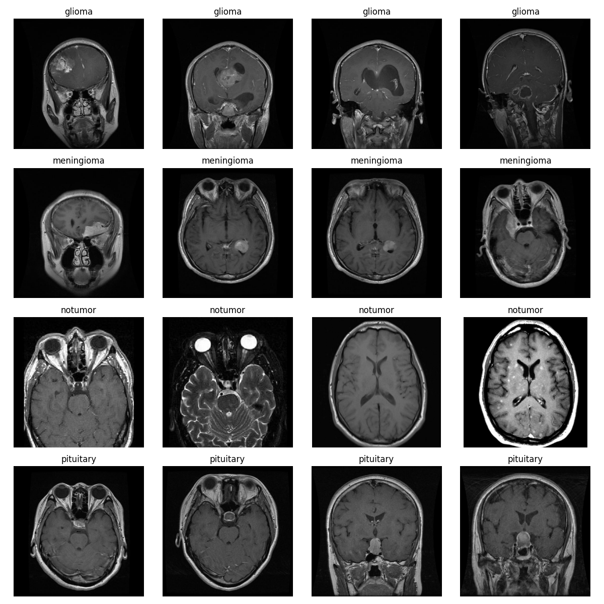

# Brain Tumor MRI Classification with PyTorch

This project implements a brain tumor classifier using a pretrained ResNet-18 model in PyTorch. It classifies T1-weighted MRI images into four categories: **glioma tumor**, **meningioma tumor**, **pituitary tumor**, and **no tumor**. The pipeline includes data loading, preprocessing, training, evaluation, and inference.

## Preprint

If you're interested in the methodology and results, please refer to our research preprint:

**Bassi, J.** (2025). *Brain Tumor Classification with Pretrained CNNs in PyTorch*.  
[DOI: 10.13140/RG.2.2.21638.28484](https://doi.org/10.13140/RG.2.2.21638.28484)

This paper details the architecture, transfer learning approach, dataset setup, and evaluation metrics, including training accuracy, confusion matrix, and limitations of the model.

---

## Dataset

The dataset used is the **Brain Tumor Classification (MRI)** dataset by Ghaffar et al., available on [Mendeley Data](https://data.mendeley.com/datasets/w4sw3s9f59/1).

**Download**:
[https://data.mendeley.com/datasets/w4sw3s9f59/1](https://data.mendeley.com/datasets/w4sw3s9f59/1)

**Structure**:

```
Training/
├── glioma_tumor/
├── meningioma_tumor/
├── pituitary_tumor/
└── no_tumor/

Testing/
├── glioma_tumor/
├── meningioma_tumor/
├── pituitary_tumor/
└── no_tumor/
```

After downloading, extract the archive and place the contents in your project directory. You can rename the `Training/` folder to `data/` or provide its path using the `--data_dir` flag.



---

## Installation

1. Clone the repository:

   ```bash
   git clone https://github.com/yourusername/brain-tumor-classifier.git
   cd brain-tumor-classifier
   ```

2. Install dependencies:

   ```bash
   pip install -r requirements.txt
   ```

**Required packages**:

* `torch`
* `torchvision`
* `Pillow`

---

## Training

To train the model:

```bash
python train.py \
    --data_dir ./data \
    --epochs 10 \
    --batch_size 32 \
    --learning_rate 0.001 \
    --output_model tumor_model.pth
```

* The dataset is split into training and validation sets (80/20).
* Accuracy and loss are printed after each epoch.
* The best-performing model is saved to the specified path.

---

## Inference

To classify a new MRI image:

```bash
python inference.py \
    --model_path tumor_model.pth \
    --image_path ./data/glioma_tumor/example1.jpg
```

**Output**:

```
Predicted class: glioma_tumor
```

---

## Project Structure

```
.
├── data_loader.py        # Dataset class and data loader utilities
├── model.py              # ResNet18-based classification model
├── train.py              # Model training script
├── inference.py          # Inference script for single image prediction
├── requirements.txt      # List of dependencies
├── Figure_1.png          # Sample visualization (optional)
└── README.md             # Project overview and instructions
```

---

## Citation

**Dataset**:

> Ghaffar, A. (2024). *Brain Tumor Classification (MRI)*. Mendeley Data, V1. [https://doi.org/10.17632/w4sw3s9f59.1](https://doi.org/10.17632/w4sw3s9f59.1)

