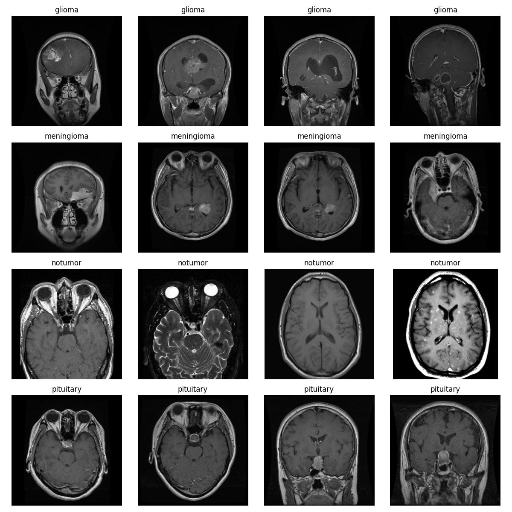

# Brain Tumor MRI Classification with PyTorch

This project implements a brain tumor classifier using a pretrained ResNet-18 model in PyTorch. It classifies T1-weighted MRI images into four categories: **glioma tumor**, **meningioma tumor**, **pituitary tumor**, and **no tumor**. The pipeline includes data loading, preprocessing, training, evaluation, and inference.

## Preprint

If you're interested in the methodology and results, please refer to our research preprint:

**Bassi, J.** (2025). *Brain Tumor Classification with Pretrained CNNs in PyTorch*.  
[DOI: 10.13140/RG.2.2.21638.28484](https://doi.org/10.13140/RG.2.2.21638.28484)

This paper details the architecture, transfer learning approach, dataset setup, and evaluation metrics, including training accuracy, confusion matrix, and limitations of the model.

---

## Dataset

The dataset used is the **Brain Tumor Classification (MRI)** dataset by Ghaffar et al., available on [Mendeley Data](https://data.mendeley.com/datasets/w4sw3s9f59/1).

**Download**:
[https://data.mendeley.com/datasets/w4sw3s9f59/1](https://data.mendeley.com/datasets/w4sw3s9f59/1)

**Structure**:

```
Training/
├── glioma_tumor/
├── meningioma_tumor/
├── pituitary_tumor/
└── no_tumor/

Testing/
├── glioma_tumor/
├── meningioma_tumor/
├── pituitary_tumor/
└── no_tumor/
```

After downloading, extract the archive and place the contents in your project directory. You can rename the `Training/` folder to `data/` or provide its path using the `--data_dir` flag.



---

## Installation

1. Clone the repository:

   ```bash
   git clone https://github.com/yourusername/brain-tumor-classifier.git
   cd brain-tumor-classifier
   ```

2. Install dependencies:

   ```bash
   pip install -r requirements.txt
   ```

**Required packages**:

* `torch`
* `torchvision`
* `Pillow`

---

## Training

Point `--data_dir` at the dataset root (the folder that directly contains `Training/` and `Testing/`):

```bash
python train.py \
    --data_dir ./data \
    --backbone resnet18 \
    --epochs 30 \
    --batch_size 32 \
    --learning_rate 0.0001 \
    --augment \
    --output_model tumor_model.pth
```

* The `Training` split is stratified 80/20 into train and validation sets; `Testing` is kept fully held out for `evaluate.py`.
* `--augment` turns on random flip/rotation/color-jitter for training images.
* `--balance_classes` uses a class-weighted sampler if your class counts are uneven.
* Training stops early if validation loss hasn't improved for `--patience` epochs (default 5), and the learning rate is halved on a plateau.
* The checkpoint saved to `--output_model` bundles the weights with `class_names` and `backbone`, so downstream scripts never need to hardcode the class order.
* Also writes `history.json`, `training_curves.png`, and `confusion_matrix_val.png`.

Other backbones: `--backbone resnet34` or `--backbone efficientnet_b0`. Add `--freeze_backbone` to only train the new classification head (faster, useful for quick experiments).

---

## Evaluation

Run the held-out test set through a trained checkpoint to get precision/recall/F1 per class plus the figures used in the paper:

```bash
python evaluate.py --data_dir ./data --model_path tumor_model.pth
```

Produces `confusion_matrix.png`, `roc_curves.png`, and `misclassified_examples.png`.

## Interpretability (Grad-CAM)

```bash
python gradcam.py --data_dir ./data --model_path tumor_model.pth
```

Saves `gradcam_examples.png`, one heatmap overlay per class, showing which regions of the scan drove the prediction (Selvaraju et al., 2017).

## Dataset figures

```bash
python visualizer.py --data_dir ./data --save
```

Saves `sample_grid.png` and `class_distribution.png`.

---

## Inference

To classify a new MRI image:

```bash
python inference.py \
    --model_path tumor_model.pth \
    --image_path ./data/Testing/glioma/example1.jpg
```

**Output**:

```
Predicted class: glioma (91.4% confidence)
Runner-up predictions:
  meningioma: 5.2%
  pituitary: 2.1%
```

---

## Project Structure

```
.
├── data_loader.py         # Dataset class and DataLoader utilities (stratified split, augmentation)
├── model.py                # Backbone factory (ResNet-18/34, EfficientNet-B0) + Grad-CAM hook
├── train.py                  # Training loop: early stopping, LR scheduling, checkpoint metadata
├── evaluate.py                 # Test-set metrics, confusion matrix, ROC curves, misclassified grid
├── gradcam.py                    # Grad-CAM heatmap generation
├── inference.py                    # Single-image inference
├── visualizer.py                     # Sample grid + class distribution figures
├── utils.py                            # Seeding, checkpoint I/O, shared plotting helpers
├── requirements.txt                      # List of dependencies
├── Figure_1.png                            # Sample visualization (optional)
├── main.tex                                  # Paper source
└── README.md                                   # Project overview and instructions
```

---

## Citation

**Dataset**:

> Ghaffar, A. (2024). *Brain Tumor Classification (MRI)*. Mendeley Data, V1. [https://doi.org/10.17632/w4sw3s9f59.1](https://doi.org/10.17632/w4sw3s9f59.1)

